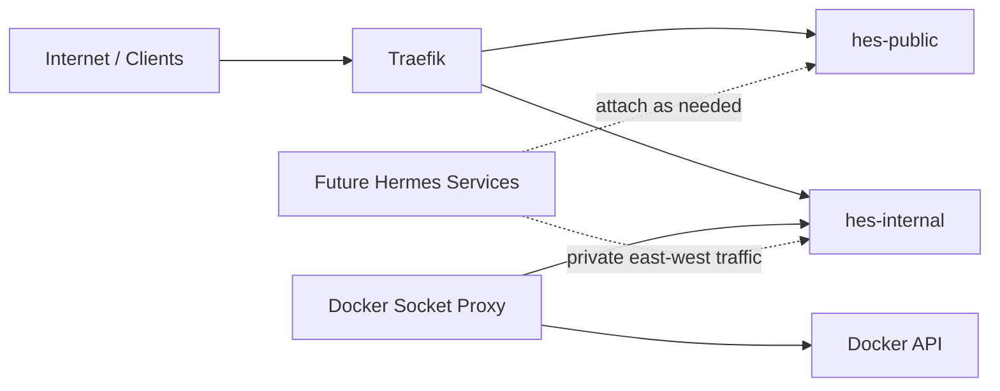
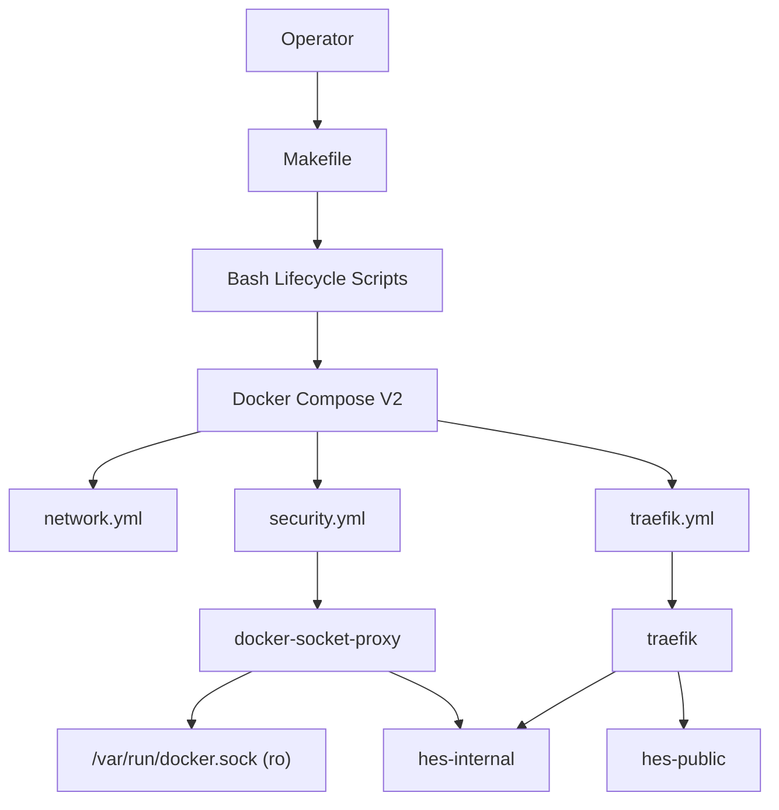
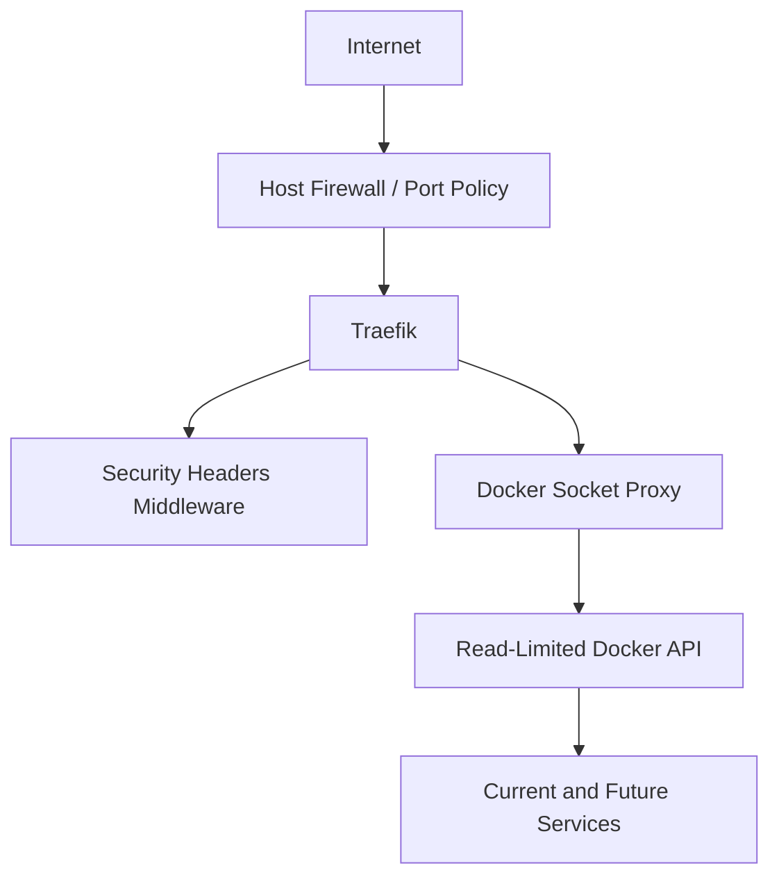
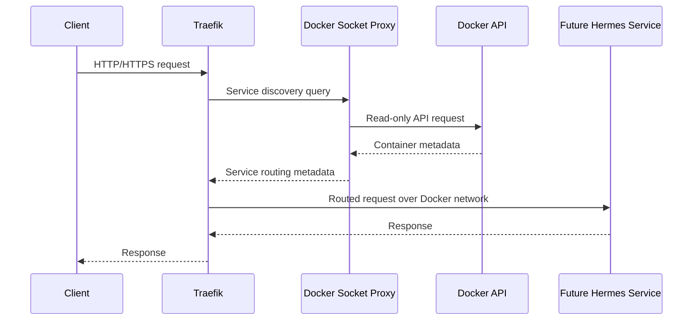
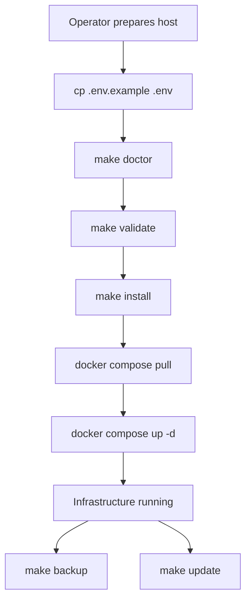

<!--
Hermes Enterprise Stack (HES)
File: docs/ARCHITECTURE.md
Purpose: Explain the complete Phase 1 infrastructure architecture and future extension model.
-->

# Architecture

Hermes Enterprise Stack Phase 1 is the infrastructure foundation for future Hermes services. It is intentionally limited to platform building blocks: Docker Compose orchestration, network boundaries, Traefik ingress, Docker socket proxy security, operational scripts, backup and restore, and deployment documentation.

This document describes the current infrastructure and the contract that future Hermes services must follow when the platform expands beyond 50 services.

## Architecture Goals

- Keep infrastructure concerns separate from application concerns.
- Keep the stack modular and readable as the number of services grows.
- Keep security boundaries explicit.
- Keep operations repeatable and idempotent.
- Keep configuration externalized through `.env`.
- Keep future service onboarding predictable.

## Current Phase 1 Components

| Layer | Current Component | Responsibility |
| --- | --- | --- |
| Orchestration | `compose/compose.yml` | Includes the active infrastructure modules. |
| Network | `compose/network.yml` | Defines public and internal Docker networks. |
| Security | `compose/security.yml` | Runs the Docker socket proxy with reduced API access. |
| Ingress | `compose/traefik.yml` | Provides HTTP/HTTPS entrypoints and service discovery. |
| Provider Layer | `config/providers/`, `runtime/` | Selects Hermes provider metadata without implementing Hermes. |
| Configuration | `config/` | Holds safe-to-commit runtime configuration. |
| Operations | `scripts/` | Provides install, validate, doctor, repair, update, backup, restore, and uninstall workflows. |
| State | `logs/`, `backup/`, `storage/`, `ssl/`, `data/` | Holds runtime state outside tracked source files. |

## Infrastructure Overview

Phase 1 uses a layered model:

1. Operators interact with the platform through `make` targets and lifecycle scripts.
2. Lifecycle scripts validate the host, load `.env`, prepare directories, and invoke Docker Compose.
3. Docker Compose assembles modular infrastructure from separate Compose files.
4. Traefik handles ingress and service discovery through the Docker socket proxy.
5. Runtime state is written to managed directories under the project root.

## Network Diagram



## Docker Diagram



## Clean Architecture Boundary

Phase 1 deliberately avoids embedding business services into the infrastructure layer.

- Compose modules describe platform resources.
- Scripts implement operational workflows.
- Config files define reusable platform behavior.
- Documentation captures the operating contract.
- Runtime directories hold mutable platform state.

Future Hermes services must consume this infrastructure through documented contracts such as network membership, Traefik labels, configuration, logging, and backup expectations. They should not bypass the platform with ad hoc host bindings or unmanaged storage.

## Traefik

Traefik is the Phase 1 ingress controller.

Responsibilities:

- Accept HTTP traffic on port `80`.
- Accept HTTPS traffic on port `443`.
- Redirect plain HTTP to HTTPS.
- Discover services through the Docker provider.
- Read dynamic middleware configuration from `config/traefik/dynamic`.
- Persist ACME certificate state under `ssl/letsencrypt`.
- Write access logs to `logs/traefik/access.log`.

Important Phase 1 constraints:

- Traefik does not mount `/var/run/docker.sock` directly.
- Traefik reaches the Docker API through the socket proxy only.
- Traefik dashboard routing is disabled in Phase 1.
- Future dashboard exposure must be added as an authenticated administrative path, not as a default.

## Security Layers



Security controls in Phase 1:

- Network segmentation:
  `hes-public` is for ingress-facing traffic, `hes-internal` is for internal traffic.
- Docker API isolation:
  service discovery is proxied through Docker socket proxy with a minimal API surface.
- Container hardening:
  services use `no-new-privileges`, dropped capabilities, read-only filesystems where possible, explicit `tmpfs`, and process limits.
- Runtime directory protection:
  managed directories are marked with `.hes-managed`, and destructive cleanup refuses unmanaged paths.
- Configuration hygiene:
  `.env` is parsed as data, not executed as shell.
- Backup protection:
  backup archives include `.env` and are written with owner-only permissions.

## Data Flow



Current Phase 1 note:

Phase 1 does not yet run Hermes application services, so the final hop shown above describes the future steady-state request flow rather than a currently deployed data plane.

## Deployment Workflow



Deployment steps:

1. Prepare `.env` with environment-specific values.
2. Run `make doctor` to confirm host readiness.
3. Run `make validate` to check scripts, line endings, policy rules, and Compose configuration.
4. Run `make install` to prepare directories, pull images, and start the infrastructure.
5. Use `make backup`, `make update`, `make logs`, and `make status` for routine operations.

## Folder Tree

```text
Hermes-Enterprise/
  compose/      Compose modules and Compose conventions.
  config/       Safe-to-commit runtime configuration.
  scripts/      Idempotent Bash lifecycle scripts.
  docs/         Architecture, operations, security, audit, and HTML docs.
  workspace/    Local operator workspace.
  logs/         Container and script logs.
  backup/       Backup archives.
  storage/      Future service storage.
  ssl/          TLS and ACME state.
  data/         Future persistent service data.
  .github/      GitHub automation and validation workflow.
```

## Future Hermes Services

Future Hermes services are intentionally absent in Phase 1, but the platform is already structured for them.

Sprint 3.0 adds a provider layer so future Hermes work is not tied to one fixed Docker image. Hermes implementation must flow through provider selection before any Compose module is generated.

Provider layer responsibilities:

- `config/providers/` stores provider manifests and the provider interface.
- `runtime/provider-loader.sh` validates selected provider metadata.
- `compose/providers/` is reserved for future provider-specific Compose fragments.
- `docs/providers/` documents provider rules, supported reference providers, future providers, and custom providers.
- `HERMES_PROVIDER`, `HERMES_REGISTRY`, `HERMES_IMAGE`, and `HERMES_VERSION` control provider selection.

Expected future model:

- Each Hermes service family must resolve provider metadata before choosing runtime details.
- Each service family should have a dedicated Compose module.
- Each service must declare only the networks it actually needs.
- Public-facing services should route through Traefik rather than exposing host ports directly.
- Internal-only services should stay off published ports.
- Every service must include health checks, log rotation, labels, restart policy, and environment-driven configuration.
- Every service must document backup implications and operational ownership.

Examples of future module patterns:

- `compose/hermes-api.yml`
- `compose/hermes-worker.yml`
- `compose/messaging.yml`
- `compose/datastore.yml`
- `compose/observability.yml`

## Monitoring

Phase 1 does not deploy a full observability stack. That is intentional.

Current monitoring signals:

- Docker Compose service status through `make status`.
- Container logs through `make logs`.
- Script lifecycle logs under `logs/scripts`.
- Traefik access logs under `logs/traefik/access.log`.
- Health checks defined in infrastructure containers.

Future monitoring direction:

- Metrics collection should arrive in a dedicated observability module.
- Centralized logs should arrive in a dedicated observability module.
- Alerting should be introduced only after metrics ownership, routing, and escalation policy are defined.

## Backup

Phase 1 backup scope:

- `.env`
- `compose/`
- `config/`
- `ssl/`
- `storage/`
- `data/`

Backup behavior:

- Archives are timestamped.
- Old archives are pruned by retention policy.
- Backups are written to `HES_BACKUP_DIR`.
- Archives use owner-only permissions because they contain configuration and secrets.

Restore behavior:

- Archive paths are validated before extraction.
- Restore runs through a staging directory.
- Unsafe archive entries are rejected.
- Managed runtime directories are cleared and repopulated only through validated paths.

## Scalability

Phase 1 is small by design, but it is built for a much larger future.

Scalability decisions already in place:

- Modular Compose files instead of one large file.
- Service-to-service communication by DNS-safe service names.
- Environment-driven naming for shared resources.
- Internal and public network separation.
- Label conventions for inventory and automation.
- Log rotation defaults.
- Validation rules that reject common future drift such as `container_name`, `version`, and `latest`.

For a 50+ service platform, these patterns matter more than today’s service count because they keep expansion predictable and reviewable.

## High Availability

Phase 1 is production-oriented but not yet fully highly available.

Current state:

- Traefik is a single container.
- Docker socket proxy is a single container.
- Compose runs on a single Docker host model.
- Local runtime state is host-bound.

What this means:

- Phase 1 is a strong single-node foundation.
- It is not yet a multi-node control plane.
- It reduces operational risk but does not eliminate single-host failure.

Future HA direction:

- Introduce redundant ingress capacity.
- Introduce externalized certificate and state strategy where required.
- Separate shared data from local host storage.
- Add node-level orchestration or cluster strategy only when operationally justified.

## Disaster Recovery

Phase 1 disaster recovery relies on repeatable infrastructure plus backup and restore.

Recovery model:

1. Rebuild or replace the Ubuntu 24.04 host.
2. Recreate the repository and `.env`.
3. Restore a trusted backup archive.
4. Re-run validation.
5. Start the stack with `make install`.

Recovery strengths:

- Infrastructure is code-driven.
- Configuration is externalized.
- Backups are restorable without direct in-place extraction.
- Scripts are idempotent and environment-aware.

Current DR limitation:

- Recovery is host-centric, not region- or cluster-centric.

## Phase 1 Constraints

These are intentional:

- No Hermes services yet.
- No dashboard exposure.
- No full monitoring stack.
- No database layer.
- No cluster orchestration layer.
- No multi-node high availability layer.

Those omissions keep Phase 1 focused on a solid infrastructure contract instead of mixing in future concerns prematurely.

## Summary

Hermes Enterprise Stack Phase 1 is a disciplined, modular, security-conscious infrastructure baseline. It gives future Hermes services a clean platform to attach to, while keeping operations, validation, backup, and security practices in place early enough to support long-term growth.
